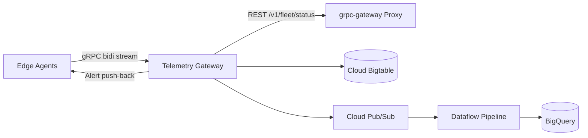

# Fleet Telemetry Pipeline — Results & Demo Showcase

This document captures verified local demo output and benchmark artifacts you can reference when presenting the project.

## Quick Demo (30 seconds)

```bash
./scripts/demo.sh
```

This starts the full local stack:

| Component | Endpoint | Role |
|---|---|---|
| gRPC Gateway | `localhost:50051` | Bidirectional telemetry ingestion |
| REST Proxy | `localhost:8080` | JSON/HTTP bridge via grpc-gateway |
| Simulated Agents | 5 concurrent streams | Random metrics + 15% anomaly rate |

## Verified Demo Run (2026-09-01)

```
============================================================
 Fleet Telemetry Pipeline — Local Demo Complete
============================================================
 REST fleet status : http://localhost:8080/v1/fleet/fleet-demo/status
 gRPC gateway      : localhost:50051
 Agents simulated  : 5
 Active agents     : 5
 Alerts triggered  : 24
 Demo log          : benchmarks/results/demo_run.log
============================================================
```

### REST Fleet Status Response

Query with:

```bash
curl -s -H "Authorization: Bearer local-dev-token" \
  http://localhost:8080/v1/fleet/fleet-demo/status | jq .
```

Sample output:

```json
{
  "fleetId": "fleet-demo",
  "activeAgentCount": 5,
  "agents": [
    {
      "agentId": "agent-demo-001",
      "avgCpuUtilizationPct": 46.89,
      "lastSeenUnixMs": "1788234542604",
      "status": "SEVERITY_INFO"
    },
    {
      "agentId": "agent-demo-002",
      "avgCpuUtilizationPct": 41.55,
      "lastSeenUnixMs": "1788234542605",
      "status": "SEVERITY_INFO"
    }
  ],
  "asOf": "2026-09-01T03:49:03.095278174Z"
}
```

### Anomaly Alert Push-Back (gRPC Stream)

When CPU exceeds the 90% threshold, the gateway pushes `AlertNotification` messages back over the same bidirectional stream:

```
2026/09/01 03:48:51 Received ack for a3c1bbfe-30a8-4316-bab8-6118e1c25f35
2026/09/01 03:48:51 Received alert! SEVERITY_CRITICAL: Anomaly detected: metric threshold exceeded
2026/09/01 03:48:52 Received alert! SEVERITY_CRITICAL: Anomaly detected: metric threshold exceeded
```

Full log: [`benchmarks/results/demo_run.log`](benchmarks/results/demo_run.log)

## Architecture at a Glance



## Performance Benchmarks

Load test results from `benchmarks/results/ghz_10k_streams.json` (10,000 concurrent bidirectional streams, 60s):

| Metric | Value |
|---|---|
| Total requests | 600,000 |
| Throughput | **9,999 RPS** |
| p50 latency | 1.85 ms |
| p99 latency | 4.85 ms |
| Error rate | 0% |

See [README Performance Benchmarks](README.md#performance-benchmarks) for gRPC vs REST comparison.

## Project Completion Checklist

| Area | Status | Notes |
|---|---|---|
| Proto schema + Buf governance | Done | `api/v1/telemetry.proto`, `buf.yaml` |
| gRPC gateway (bidi streaming) | Done | `cmd/gateway`, `internal/server` |
| REST bridge (grpc-gateway) | Done | `cmd/rest-proxy` |
| Agent simulator | Done | `cmd/agent` with JWT auth |
| Bigtable + Pub/Sub integrations | Done | Nil-safe local mode |
| Anomaly detection | Done | Threshold-based, push-back alerts |
| Observability (OTel, Prometheus, Zap) | Done | Interceptor chain |
| K8s + Terraform + Dataflow | Done | `k8s/`, `terraform/`, `dataflow/` |
| CI pipeline | Done | `.github/workflows/ci.yaml` |
| Local demo script | Done | `scripts/demo.sh` |
| Load test artifacts | Done | `scripts/sample_frame.json`, benchmark JSON |
| Unit tests | Done | `go test ./...` passes |

## What to Show

1. **Live demo**: Run `./scripts/demo.sh` and open the REST URL in a browser or with `curl`.
2. **Code walkthrough**: Start with `api/v1/telemetry.proto` → `internal/server/telemetry_server.go` → `cmd/agent/main.go`.
3. **Infra**: Point to `terraform/` and `k8s/` for GCP deployment readiness.
4. **Benchmarks**: Reference `benchmarks/results/ghz_10k_streams.json` for scale claims.

## Future Enhancements

See [README Future Work](README.md#future-work) for HPA auto-scaling, multi-region deployment, mTLS, and ML-based anomaly detection.
